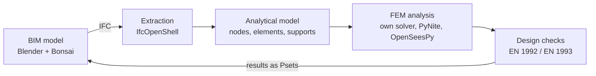

# From BIM to FEM: Structural Design of a Multi-Storey Building

A self-study project in structural engineering and digitalisation. A realistic multi-storey building is modelled as IFC in Blender/Bonsai, converted automatically into an analytical model in Python, analysed with self-written and open-source FEM tools, and verified against the Eurocodes with Danish National Annexes.

> **Status:** 🚧 Early stage. Currently learning Bonsai and developing the design brief. See the [roadmap](#roadmap) for progress.

## Goals

- Refresh and deepen FEM, statics, steel design and concrete design.
- Build an automated pipeline from a BIM model to structural analysis and design checks.
- Verify every result independently, by hand calculation and with other software.
- Keep everything open, reproducible and documented.

## The building

A 5–6 storey mixed-use building in Copenhagen, with retail on the ground floor and offices above. The structural concept is a concrete core for stability, a steel frame for gravity loads, and hollow-core or composite slabs.

The project is built in stages, so the full pipeline works on a simple version before complexity is added:

| Version | Description |
|---------|-------------|
| **A** | Regular building (baseline) |
| **B** | Column-free ground floor hall with transfer beams |
| **C** | Cantilevered or set-back top floor |

The full design basis is documented in [`docs/design_brief.md`](docs/design_brief.md).

## Workflow



## Tools

| Purpose | Tool |
|---------|------|
| BIM modelling | [Blender](https://www.blender.org/) + [Bonsai](https://bonsaibim.org/) (IFC4) |
| IFC data extraction | [IfcOpenShell](https://ifcopenshell.org/) |
| Own FEM solver | Python, NumPy, SciPy |
| 3D frame and plate analysis | [PyNite](https://github.com/JWock82/PyNite) |
| Modal and nonlinear analysis | [OpenSeesPy](https://openseespydoc.readthedocs.io/) |
| Cross-section properties | [sectionproperties](https://github.com/robbievanleeuwen/section-properties) |
| Local shell checks | [FreeCAD](https://www.freecad.org/) FEM (CalculiX) |
| Independent verification | Commercial FEM software (trial) |

## Repository structure

```
├── model/        IFC models (Versions A, B, C)
├── src/
│   ├── ifc/      IFC extraction and conversion to analytical model
│   ├── fem/      Own FEM solver (bar, beam, frame, plate elements)
│   ├── loads/    Load cases and load combinations
│   ├── design/   Eurocode design checks (steel and concrete)
│   └── utils/    Plotting and shared helpers
├── tests/        Unit tests and verification against analytical solutions
├── notebooks/    Worked examples and exploratory analyses
├── docs/         Design brief, decision log, hand calculations
└── report/       Technical report (LaTeX)
```

## Getting started

Requires Python 3.11 or newer.

```bash
git clone https://github.com/<your-username>/<repo-name>.git
cd <repo-name>

python -m venv .venv
source .venv/bin/activate      # Windows: .venv\Scripts\activate

pip install -r requirements.txt
```

Core dependencies (`requirements.txt`):

```
ifcopenshell
numpy
scipy
matplotlib
PyNiteFEA
openseespy
sectionproperties
pytest
```

Run the tests:

```bash
pytest
```

## Verification approach

No result is trusted on its own. Each part of the analysis is checked in at least one independent way:

- **Own FEM solver**: checked against analytical solutions and PyNite.
- **Global analysis**: equilibrium checks and hand calculation of the horizontal load distribution in the stabilising system.
- **Design checks**: selected members verified by hand.
- **Local effects**: shell models in FreeCAD/CalculiX.
- **Full model**: compared with commercial FEM software, with differences explained.

Assumptions and design decisions are recorded in [`docs/decisions.md`](docs/decisions.md).

## Roadmap

- [ ] Project setup
- [ ] Learn Bonsai and IFC
- [ ] Design brief and structural concept
- [ ] Structural BIM model (Version A)
- [ ] IFC-to-Python pipeline
- [ ] Own FEM solver (bar → beam → 2D frame → 3D frame → plate → modal)
- [ ] Loads and load combinations (DS/EN 1990 and 1991 with DK NA)
- [ ] Global analysis and stability
- [ ] Steel design (DS/EN 1993)
- [ ] Concrete design (DS/EN 1992)
- [ ] Model extensions (Versions B and C)
- [ ] Independent verification with commercial software
- [ ] Results written back to the IFC model
- [ ] Technical report

## Standards and references

- DS/EN 1990: Basis of structural design (with DK NA)
- DS/EN 1991-1-1, 1-3, 1-4: Actions on structures (with DK NA)
- DS/EN 1992-1-1: Design of concrete structures (with DK NA)
- DS/EN 1993-1-1, 1-5, 1-8: Design of steel structures (with DK NA)
- Teknisk Ståbi

The Eurocodes are copyrighted and are not included in this repository.

## Disclaimer

This is a learning and portfolio project. The building is fictitious, and the code and calculations are not intended for use in real structural design without independent verification by a qualified engineer.

## Author

**Joachim Hermansen**, M.Sc. in Civil Engineering (DTU)
[LinkedIn](https://www.linkedin.com/in/<your-profile>)
